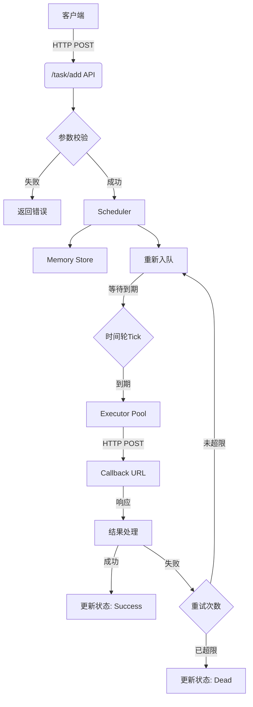
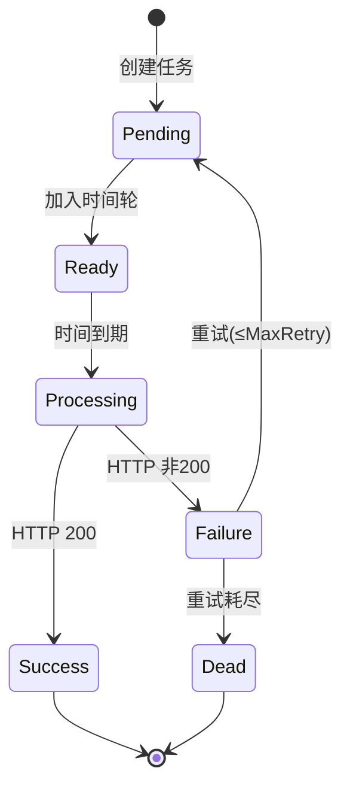

# Delay Queue

基于时间轮（Timing Wheel）的延迟任务队列系统，用于定时执行 HTTP 回调任务。

## 功能特性

- 多层时间轮实现，秒级刻度；默认配置下最长延迟约一天（可改 `layers` 扩大跨度）
- 内置重试机制，支持可配置的最大重试次数
- 工作池并发执行，提高任务处理吞吐量
- 任务状态全生命周期管理

## 技术栈

- Go 1.25+
- 标准库 net/http

## 快速开始

### 运行服务

```bash
go run cmd/server/main.go
```

服务启动后监听 `:8088` 端口。

### 添加任务

`execute_at` 必须为 **Unix 秒级时间戳**（纯数字字符串），与服务端 `strconv.ParseInt` 解析一致。下面示例为「当前时间起 2 分钟后执行」（POSIX `date` + Bash 算术，macOS / Linux 均可）：

```bash
curl -X POST "http://localhost:8088/task/add" \
  -d "id=order-123" \
  -d "callback_url=http://example.com/callback" \
  -d "payload={\"order_id\":123}" \
  -d "execute_at=$(( $(date +%s) + 120 ))"
```

将人类可读的本地日期时间转为 Unix 秒后再填入 `execute_at`：

- **macOS (BSD `date`)**：`date -j -f "%Y-%m-%d %H:%M:%S" "2026-05-01 10:00:00" "+%s"`
- **Linux (GNU `date`)**：`date -d "2026-05-01 10:00:00" +%s`

### 参数说明

| 参数 | 必填 | 说明 |
|------|------|------|
| id | 是 | 任务唯一标识 |
| callback_url | 是 | 回调地址（HTTP POST） |
| payload | 是 | 透传参数（JSON 字符串） |
| execute_at | 是 | 期望执行时刻的 **Unix 秒时间戳**（例如 `1746099600`） |

当前时间轮配置下，**延迟超过约 24 小时**的任务在添加时会失败（见 `internal/wheel/timingWheel.go` 中对最大跨度的校验）。

## 架构设计



### 核心组件

| 组件 | 文件 | 说明 |
|------|------|------|
| API | internal/api/handler.go | HTTP 接口处理 |
| Scheduler | internal/scheduler/scheduler.go | 任务调度与重试逻辑 |
| TimingWheel | internal/wheel/timingWheel.go | 多层时间轮实现 |
| Executor | internal/executor/executor.go | 工作池并发执行 |
| Store | internal/store/memory.go | 内存任务存储 |

## 任务状态流转



### 状态说明

| 状态 | 值 | 说明 |
|------|-----|------|
| Pending | 0 | 等待加入调度 |
| Ready | 1 | 已加入时间轮，等待执行 |
| Processing | 2 | 执行中 |
| Success | 3 | 执行成功 |
| Failure | 4 | 执行失败（待重试） |
| Dead | 5 | 重试耗尽，需人工处理 |

## 时间轮原理

系统采用三层时间轮设计：

| 层级 | 刻度间隔 | 槽数 | 总跨度 |
|------|---------|------|-------|
| 第 1 层 | 1 秒 | 60 | 1 分钟 |
| 第 2 层 | 1 分钟 | 60 | 1 小时 |
| 第 3 层 | 1 小时 | 24 | 1 天 |

任务根据延迟时间自动分配到合适的层级：

- 延迟 < 1 分钟：进入第 1 层
- 1 分钟 ≤ 延迟 < 1 小时：进入第 2 层
- 1 小时 ≤ 延迟 < 1 天：进入第 3 层

系统会找到第一个 totalSpan 大于延迟时间的层级，将任务放入该层级。

当低层级时间轮转一圈后，将任务晋升到高层级。

## 业务场景示例

### 场景一：订单超时自动取消

用户下单后 30 分钟未支付，自动取消订单。

```bash
curl -X POST "http://localhost:8088/task/add" \
  -d "id=order-cancel-${order_id}" \
  -d "callback_url=http://api.example.com/order/cancel" \
  -d "payload={\"order_id\":12345}" \
  -d "execute_at=$(( $(date +%s) + 30 * 60 ))"
```

### 场景二：支付超时关闭订单

用户发起支付后 15 分钟未完成支付，关闭订单。

```bash
curl -X POST "http://localhost:8088/task/add" \
  -d "id=payment-timeout-${order_id}" \
  -d "callback_url=http://api.example.com/payment/close" \
  -d "payload={\"order_id\":12345}" \
  -d "execute_at=$(( $(date +%s) + 15 * 60 ))"
```

### 场景三：商品自动下架

定时上架的商品，到期后自动下架（将「下架时刻」转为 Unix 秒；以下为 **2026-05-02 00:00:00** 本地时间）。

```bash
# macOS
EXEC_AT=$(date -j -f "%Y-%m-%d %H:%M:%S" "2026-05-02 00:00:00" "+%s")
# Linux（GNU date）
# EXEC_AT=$(date -d "2026-05-02 00:00:00" +%s)

curl -X POST "http://localhost:8088/task/add" \
  -d "id=product-offline-${product_id}" \
  -d "callback_url=http://api.example.com/product/offline" \
  -d "payload={\"product_id\":67890}" \
  -d "execute_at=${EXEC_AT}"
```

### 场景四：会员过期提醒

在指定本地日期时间发送提醒（示例：**2026-05-29 09:00:00**）。

```bash
# macOS
EXEC_AT=$(date -j -f "%Y-%m-%d %H:%M:%S" "2026-05-29 09:00:00" "+%s")
# Linux（GNU date）
# EXEC_AT=$(date -d "2026-05-29 09:00:00" +%s)

curl -X POST "http://localhost:8088/task/add" \
  -d "id=vip-reminder-${user_id}" \
  -d "callback_url=http://api.example.com/vip/remind" \
  -d "payload={\"user_id\":99999}" \
  -d "execute_at=${EXEC_AT}"
```

## 配置说明

### 修改端口

编辑 `cmd/server/main.go`：

```go
http.ListenAndServe(":8088", nil)
// 改为
http.ListenAndServe(":9090", nil)
```

### 修改时间轮配置

编辑 `cmd/server/main.go` 中的 `layers` 变量：

```go
layers := []wheel.LayerConfig{
    {
        TickDuration: time.Second,  // 第 1 层刻度
        TickCount:    60,           // 第 1 层槽数
    },
    {
        TickDuration: time.Minute,  // 第 2 层刻度
        TickCount:    60,           // 第 2 层槽数
    },
    {
        TickDuration: time.Hour,    // 第 3 层刻度
        TickCount:    24,           // 第 3 层槽数
    },
}
```

### 修改执行器并发数

编辑 `cmd/server/main.go`：

```go
sched.Executor = executor.NewExecutor(ctx, 10, &wg)
// 改为（例如 50 个 worker）
sched.Executor = executor.NewExecutor(ctx, 50, &wg)
```

### 修改重试次数

在添加任务时指定 `MaxRetry`（当前默认 3 次）：

API 暂不支持通过参数指定，可在 `internal/api/handler.go` 中修改默认行为。

## 扩展计划

### 持久化存储

当前使用内存存储，任务仅保存在内存中。重启动服务后会丢失。

后续计划支持：

- Redis 存储：适用于分布式部署场景
- MySQL 存储：适用于需要持久化保留任务的场景

### 分布式支持

- 多实例部署
- 任务分片
- 主从选举

### 监控指标

- 任务执行成功率
- 平均执行延迟
- 队列积压数量

## 运行测试

```bash
go test ./internal/... -v
```

若仓库中尚无 `*_test.go`，上述命令会快速通过且无测试输出。

## License

MIT